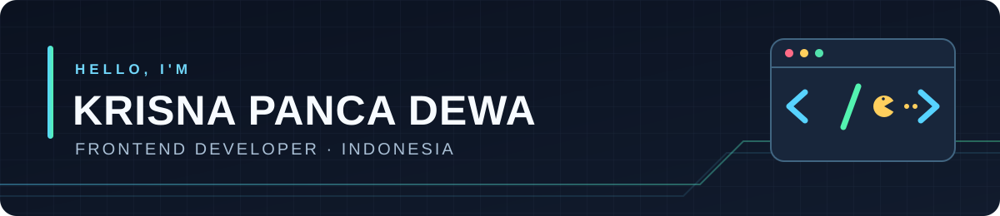

  

  I build clean, responsive web experiences with a focus on the details that make them feel good to use.

  
  

## ✨ About me

- 📍 Based in Indonesia · State Polytechnic of Jember
- 🧩 Building interfaces with React, Next.js, TypeScript, and Tailwind CSS
- 🔧 Exploring the full stack with Laravel, PHP, MySQL, and Docker

## 🛠️ I code with

**Frontend**

**Backend & tools**

## 🚀 Featured work

- **[NutriLogic](https://github.com/krizzn65/NutriLogic)** — a health and nutrition monitoring platform for children, Posyandu volunteers, and parents. `React` · `Laravel` · `MySQL`
- **[Web Property Purchase](https://github.com/krizzn65/Web-property-purchase)** — an independent frontend project built with `React` and `Tailwind CSS`.

## 🏆 GitHub achievements

  
  &nbsp;&nbsp;
  
  &nbsp;&nbsp;
  

## 🎮 Contribution arcade

  <picture>
    <source media="(prefers-color-scheme: dark)" srcset="https://raw.githubusercontent.com/krizzn65/krizzn65/output/pacman-contribution-graph-dark.svg" />
    <source media="(prefers-color-scheme: light)" srcset="https://raw.githubusercontent.com/krizzn65/krizzn65/output/pacman-contribution-graph.svg" />
    
  </picture>

Layout made with inspiration from <a href="https://github.com/maurodesouza/profile-readme-generator">Profile Readme Generator</a>.

